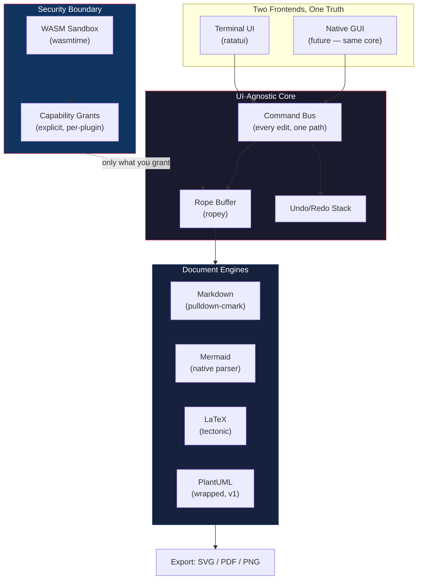

# PARA BELLUM

### *Si vis pacem, para bellum.* — If you want peace, prepare for war.

A terminal-first IDE built in Rust. No telemetry. No marketplace gatekeepers. No browser engine rendering text. Just you, the buffer, and the shell.

---

## Why

Every generation of engineers inherits tools built by the generation before. The current generation inherited editors that phone home before you've typed a single character, ship hundreds of megabytes of Chromium to render text, and default telemetry to *on* because opt-out beats opt-in when the metric that matters is engagement, not trust.

**Para Bellum** is the editor that answers to no one but the person typing in it.

- **Terminal-native.** Lives inside the machine, not next to it. No window manager tax, no GPU compositor between your keystroke and the character on screen.
- **Zero telemetry.** Not off-by-default. *Zero.* If we ever need usage data, we'll ask you in the open.
- **Auditable top to bottom.** Reproducible builds. Every dependency justified. Every decision made in public.
- **Rich documents in the terminal.** Markdown preview, Mermaid diagrams, LaTeX math — without a browser engine.
- **Sandboxed plugins.** WASM-based, capability-gated. No plugin — not even first-party — gets ambient access to your filesystem.

---

## Architecture



Notice what's **not** in this diagram: a home server. A marketplace gatekeeper. A telemetry collector.

### Workspace Layout

```
para-bellum/
├── Cargo.toml                # workspace root
├── crates/
│   ├── para-core/            # buffer, cursor, undo, command bus — NO UI code
│   ├── para-tui/             # ratatui frontend, binary target `para`
│   ├── para-syntax/          # tree-sitter integration, syntax highlighting, LSP
│   ├── para-docengine/       # markdown, mermaid, latex, plantuml → export
│   ├── para-plugin/          # wasmtime host, capability model, plugin API (WIT)
│   └── para-gui/             # native GUI stub (boundary enforcement)
└── xtask/                    # cargo-xtask for build/fuzz/release automation
```

The core architectural invariant: **`para-core` must never depend on any terminal or GUI crate.** This is enforced by `cargo xtask check-boundary` and will be enforced in CI. If the core imports `ratatui`, the TUI/GUI split is already broken.

---

## Current Status

**Week 1 complete.** The foundation is laid:

| Component | Status | Details |
|-----------|--------|---------|
| `para-core` buffer | ✅ Done | Rope-backed (`ropey`), O(log n) insert/delete, Unicode-correct |
| Command bus types | ✅ Done | `Command` enum, `InverseCommand`, `Editable` trait |
| Cursor & Selection | ✅ Done | Position tracking, bidirectional selection, sticky column |
| View system | ✅ Done | Buffer ID, scroll state, viewport dimensions |
| Undo/Redo stack | ✅ Done | Configurable max depth, redo-clearing on new edits |
| Boundary check | ✅ Done | `cargo xtask check-boundary` — zero UI deps in core |
| Unit tests | ✅ 39 passing | Buffer ops, unicode, panics, undo/redo, cursor, view |

### Roadmap

| Milestone | Target | Description |
|-----------|--------|-------------|
| **M0** | Week 4 | Core editing loop: open, edit, save, undo/redo 100+ deep, handles 50MB files |
| **M1** | Week 8 | Tree-sitter highlighting + LSP (rust-analyzer) for one language |
| **M2** | Week 12 | Live Markdown preview in terminal, CommonMark spec compliance |
| **M3** | Week 20 | Mermaid flowchart + sequence diagrams, with SVG/PNG/PDF export |
| **M4** | Week 28 | WASM plugin host with capability-gated sandbox |
| **M5** | Week 32 | First public alpha: `cargo install`, Linux x86_64 + aarch64 |

---

## Build

### Prerequisites

- [Rust](https://rustup.rs/) (stable, 1.75+)

### Build & Test

```bash
# Clone
git clone https://github.com/ansgrb/para-bellum.git
cd para-bellum

# Build the entire workspace
cargo build

# Run all tests
cargo test

# Run the boundary check (para-core must have zero terminal deps)
cargo xtask check-boundary

# Run the binary
cargo run -p para-tui
```

---

## Contributing

This is a marathon, not a sprint. We need people who want their next commit to matter.

### We need

- **Rust engineers** who've touched a rope data structure, a parser, or `wasmtime` and want to build the editor that respects every terminal in the world.
- **Security researchers** who want to red-team a capability model *before* it ships, not after it's breached.
- **Experienced maintainers** who've earned scars running open-source at scale, to help this project grow without losing what it's for.
- **You**, if you've ever closed an editor's settings menu because you couldn't find where the phone-home switch was hidden.

### How to contribute

1. **Read the code.** The entire codebase is small right now — start with [`para-core/src/buffer.rs`](crates/para-core/src/buffer.rs) and [`para-core/src/command.rs`](crates/para-core/src/command.rs).
2. **Open an issue** before writing code. Describe the problem, not the solution. We'll design it together.
3. **Submit a PR.** Keep it focused — one concern per PR. Tests required. Clippy must pass with `pedantic` + `nursery`.
4. **Review others' work.** Good code review is as valuable as good code.

### What we refuse to build

We believe a manifesto that only says what it's *for* is a brochure. Here's what we're against:

- **No telemetry-by-default.** Ever.
- **No single-company marketplace** as the only plugin distribution channel. Anyone can run a registry.
- **No binaries you can't verify.** Reproducible builds mean the binary you run is provably the source you can read.
- **No bloat past what the terminal can justify.** Every dependency earns its place or it doesn't ship.
- **No calling a wrapped external tool "native."** When we shell out, we say so in the docs.

### Code standards

- Workspace lints enforce `forbid(unsafe_code)`, `warn(clippy::pedantic)`, `warn(clippy::nursery)`
- Every public item has a doc comment
- Unit tests for every non-trivial function
- The architectural boundary is non-negotiable: `para-core` stays UI-free

---

## Why Rust, Why Now

Rust made memory-safe systems programming a default choice, not a research paper. WebAssembly made sandboxed plugin execution a shippable standard. Tree-sitter made incremental syntax parsing something every language gets for free. The infrastructure that would have made this impossible five years ago now exists — tested, in production, at scale.

The tools to build the editor that respects you were not available when VSCode launched. They are available now.

---

## License

Licensed under either of:

- [MIT License](LICENSE-MIT)
- [Apache License, Version 2.0](LICENSE-APACHE)

at your option.

---

<sub>**Para Bellum.** *Prepare accordingly.*</sub>
